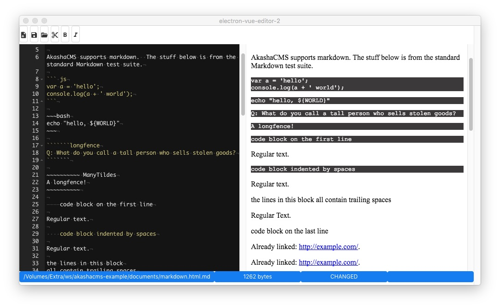

# electron-vue-buefy-editor

A Markdown editor with live preview written using Vue.js, Buefy (Bulma), the Ace editor component, and running inside the Electron framework.  It uses

* The Electron-Vue framework to support Vue.js in Electron
* Buefy supports the excellent Bulma UI toolkit in Electron
* `vue2-ace-editor` supports the excellent Ace editor as a Vue.js component

To read a full write-up, see: 



#### Build Setup

``` bash
# install dependencies
npm install

# serve with hot reload at localhost:9080
npm run dev

# build electron application for production
npm run build
```

